# 📌 SO:U+

 

## 목차

- [📌 서비스 소개](#introduction)
- [🛠️ 기술 스택](#tech)
- [🌟 주요 기능](#function)
- [📹 시연 영상](#video)
- [📏 Commit Convention](#convention)
- [🧑🏻‍💻 프로젝트 멤버](#member)

 

## 📌 서비스 소개 

### 📍 “LG U+고객 대상으로 통신사 상담 요약&관리 웹 서비스"

> SO:U+는 Summarize(요약)&Organization(구조화)을 결합한 이름으로, **상담**까지만 도와주는 보통의 상담 서비스와 다르게 **요약 후** 정보를 다시 꺼내보는 **활용**까지 사용자를 도와주는 서비스 입니다.

 

- **프로젝트 기간** : 2026.01.12 ~ 2026.01.30
- **기대효과**
  - **AI 상담 요약**
    - 대화 내용을 자동으로 요약·분석하여 기록함으로써, 별도의 메모 없이도 상담 내용을 효율적으로 관리할 수 있습니다.
  - **추가 AI 상담 지원**
    - 요약된 상담 내용을 기반으로 추가 질의응답이 가능해, 재문의 없이 문제를 해결할 수 있어 사용자 편의성이 향상됩니다.
  - **용어 사전 제공**
    - 이해하기 어려운 용어를 LG U+가 제공하는 ‘참 쉬운 용어 사전’ 기반으로 설명하여, 상담 내용을 보다 쉽게 이해할 수 있습니다.

 

## 🛠️ 기술 스택 (Tech Stack)

> 모든 기술에 정답은 없다. 다른 팀을 따라할 이유도 없다.
> `trade-off` 사이에서 팀에 `fit`한 근거만 있으면 그것이 정답이다.

 

| 역할                        | 스택                                                                                                                                                                                                               |
| --------------------------- | ------------------------------------------------------------------------------------------------------------------------------------------------------------------------------------------------------------------ |
| **UI Library**              |                                                                                                            |
| **Language**                |                                                                                                   |
| **Styling**                 |                                                                                                |
| **Server State management** |                                                                                      |
| **Formatting**              |   |
| **Version Control**         |     |
| **Deployment**              |                                                                                                               |

 

## 🌟 주요 기능

### Auth 페이지

- **회원가입 및 로그인**  
  카카오 OAuth를 통해 간편하게 회원가입 및 로그인이 가능합니다.  
  회원가입 시 추가 서비스 약관 동의 페이지가 제공되며, 필수 항목 동의 후 가입이 완료됩니다.

  <table>
    <tr>
    <td>
    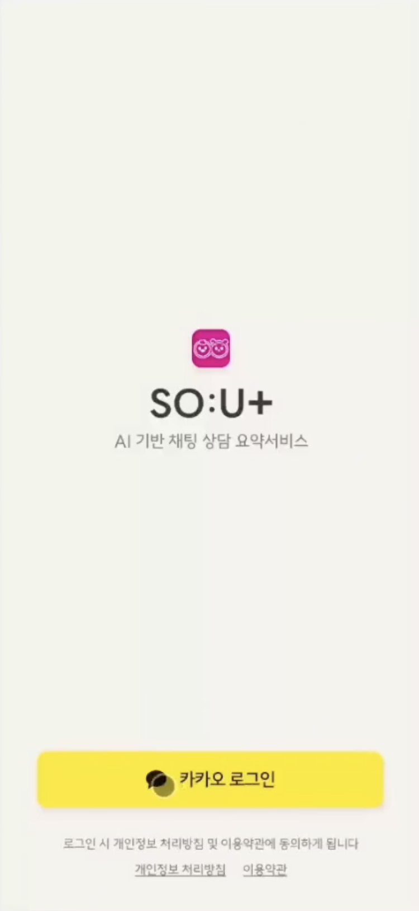
    </td>
    <td>
    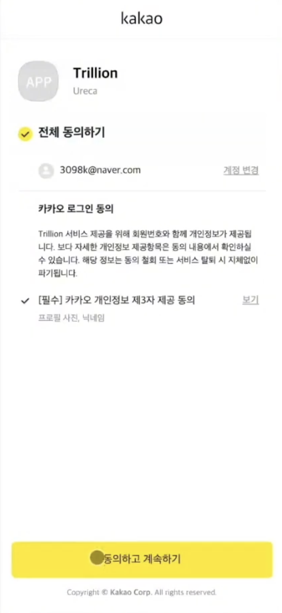
    </td>
    <td>
    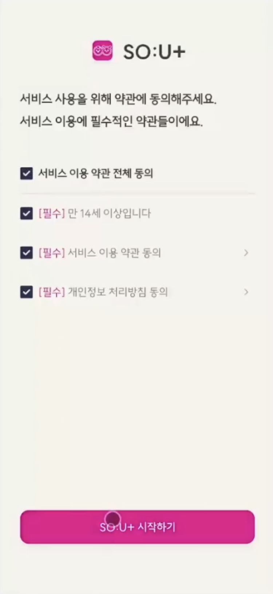
    </td>
    </tr>
    <tr>
    <td align="center">회원가입 및 로그인</td>
    <td align="center">카카오 약관 동의</td>
    <td align="center">온보딩 (회원가입 시)</td>
    </tr>
  </table>

 

### 메인 페이지

- **홈 화면**  
  요약 시작, 요약 결과 확인, FAQ 이동이 가능하며, 하단 Tab Bar를 통해 상담 내역 등록 및 상담 요약 리스트로 이동할 수 있습니다.

    <table>
      <tr>
        <td>
          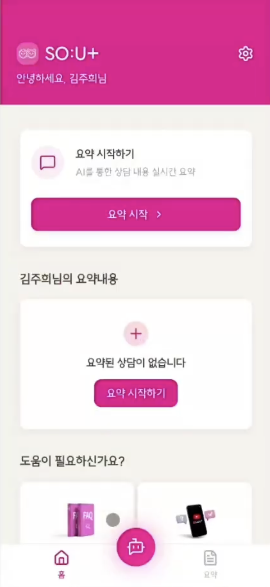
        </td>
        <td>
          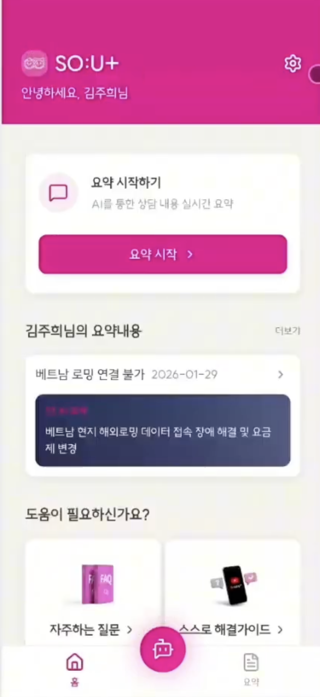
        </td>
      </tr>
      <tr>
        <td align="center">기본 홈 화면</td>
        <td align="center">요약 내용이 있는 경우</td>
      </tr>
    </table>

 

- **상담 내역 등록 화면**  
  전화 또는 채팅 기반 상담 데이터를 등록하고, 이를 바탕으로 상담 요약을 요청할 수 있습니다.

  <table>
    <tr>
      <td>
        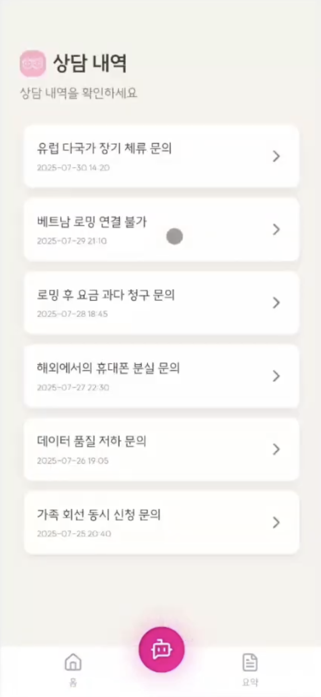
      </td>
      <td>
        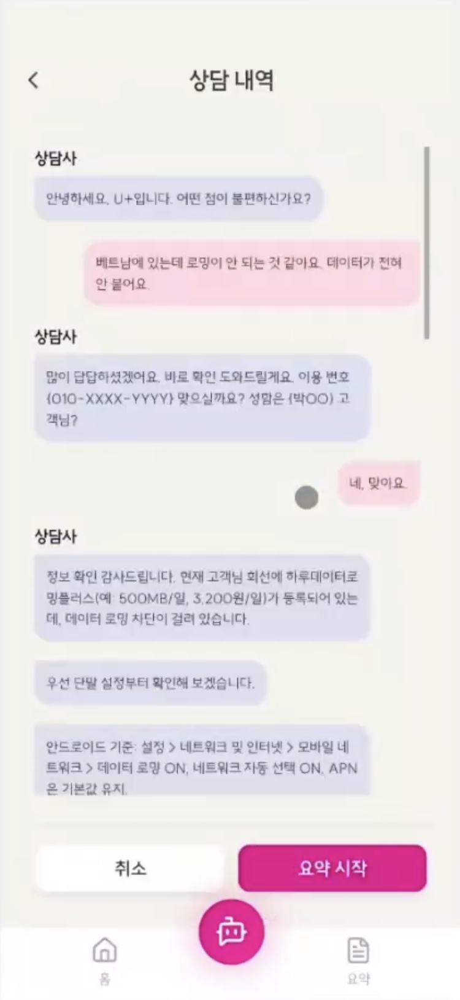
      </td>
    </tr>
    <tr>
      <td align="center">상담 내역 리스트</td>
      <td align="center">상담 내역 기반 채팅</td>
    </tr>
  </table>

 

- **상담 요약 내역 화면**  
  상담 요약 진행 상태를 실시간(SSE)으로 확인할 수 있으며, 실패 시 재시도가 가능합니다.

  <table>
    <tr>
      <td>
        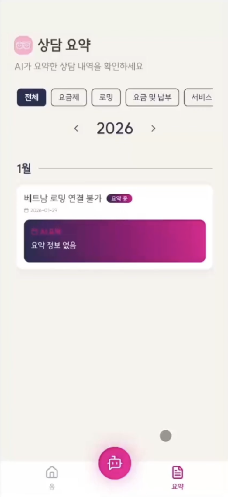
      </td>
      <td>
        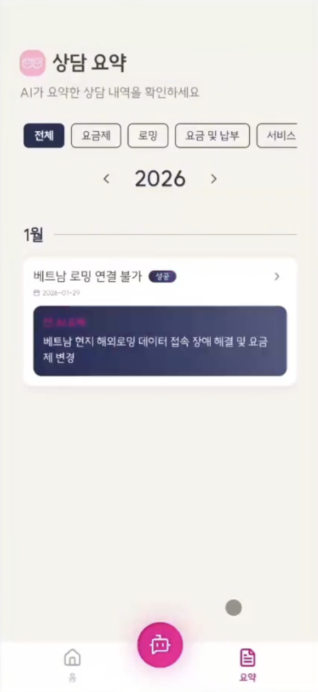
      </td>
      <td>
        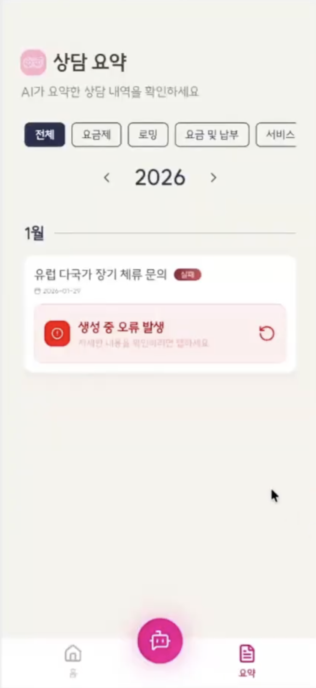
      </td>
    </tr>
    <tr>
      <td align="center">요약 진행 중</td>
      <td align="center">요약 완료</td>
      <td align="center">요약 실패 (재시도)</td>
    </tr>
  </table>

 

- **상담 요약 상세 화면**  
  생성된 요약의 상세 내용을 확인할 수 있으며, 용어 설명과 추가 AI 질의응답 기능을 제공합니다.

  <table>
    <tr>
      <td>
        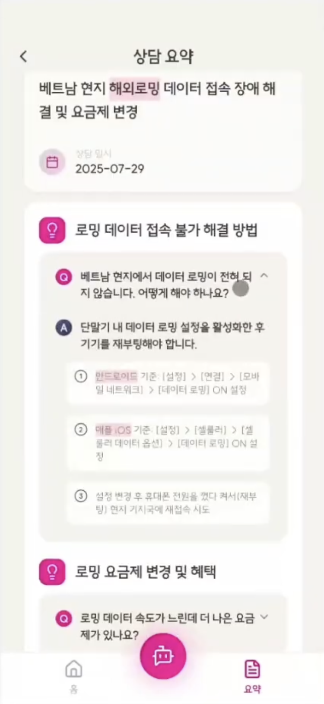
      </td>
      <td>
        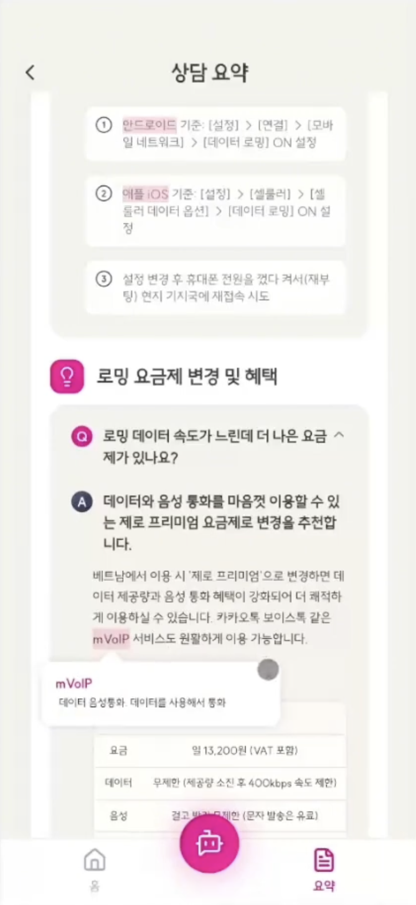
      </td>
    </tr>
    <tr>
      <td align="center">요약 상세</td>
      <td align="center">용어 설명</td>
    </tr>
  </table>
   
  <table>
    <tr>
      <td>
        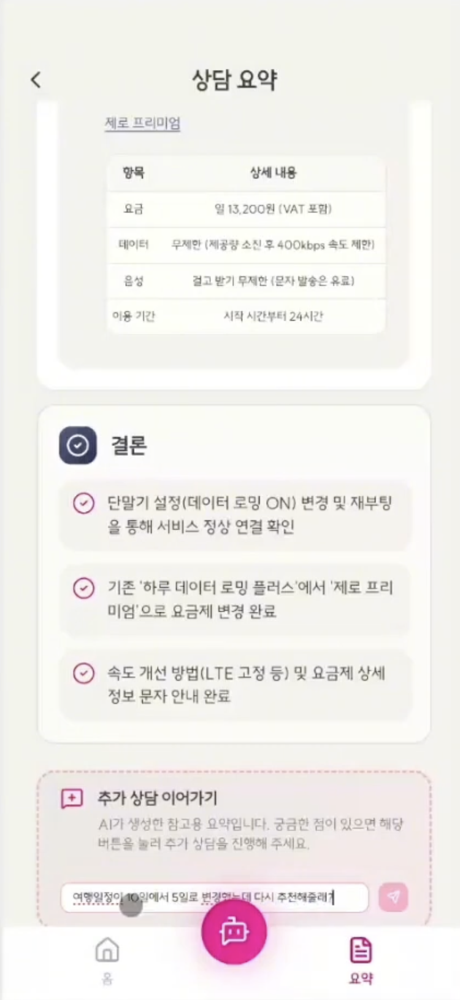
      </td>
      <td>
        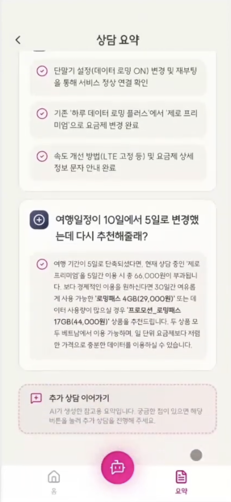
      </td>
    </tr>
    <tr>
      <td align="center">추가 질의 입력</td>
      <td align="center">AI 답변</td>
    </tr>
  </table>

 

### 설정 페이지

- **설정**  
서비스 문의, 이용약관, 고객센터 연결 기능을 제공하며, 로그아웃 및 회원탈퇴가 가능합니다.

  <table>
    <tr>
      <td>
        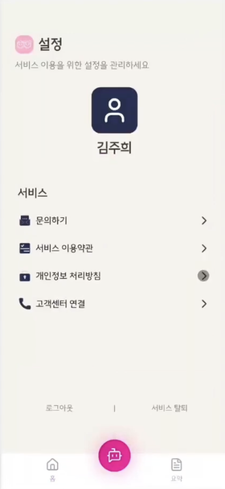
      </td>
      <td>
        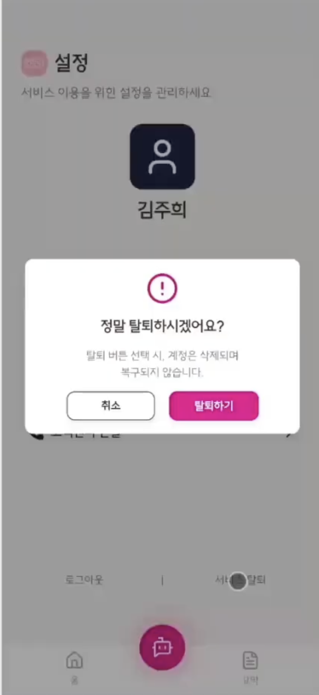
      </td>
    </tr>
    <tr>
      <td align="center">설정 화면</td>
      <td align="center">회원탈퇴</td>
    </tr>
  </table>

 

## 📹 시연 영상

[https://youtu.be/JYzL3i6O7VU](https://www.youtube.com/watch?v=JYzL3i6O7VU)

 

## 📍 Commit Convention

**Commit 메시지 종류 설명**

| 제목       | 내용                                                            |
| ---------- | --------------------------------------------------------------- |
| `setting`  | 초기 세팅 + 패키지 설치 등 개발 설정 관련                       |
| `feat`     | 새로운 기능 추가 / 퍼블리싱                                     |
| `fix`      | 버그 수정                                                       |
| `refactor` | 프로덕션 코드 리팩토링 및 QA 반영                               |
| `chore`    | 빌드 테스트 업데이트, 패키지 매니저 설정 (프로덕션 코드 변경 X) |
| `remove`   | 파일 삭제 작업만 수행                                           |
| `docs`     | 문서 수정                                                       |
| `HOTFIX`   | 치명적인 버그 수정                                              |

 

## 🧑🏻‍💻 프로젝트 멤버

|                  이름                   | 역할               |
| :-------------------------------------: | :----------------- |
| [강현우](https://github.com/hyunw-kang) | TL, Design, FE, BE |
|   [김주희](https://github.com/joooii)   | Design, FE, BE     |
|   [김채원](https://github.com/0dimen)   | FE, BE, AI         |
|  [나원빈](https://github.com/tray0244)  | FE, BE, AI         |

 
